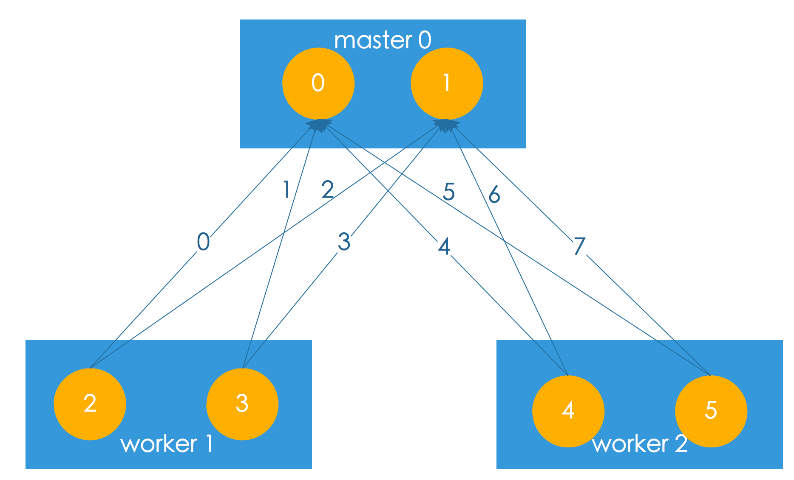

# Numbskull

## Installation
#### Ubuntu 14.04
```sudo apt install libboost-all-dev cmake```

This will install boost 1.54.0 and openmpi 1.6.5

#### Ubuntu 16.04
```sudo apt install libboost-all-dev cmake```

This will install boost 1.58.0 and openmpi 1.10

## Compile and Run
### Use cmake
**support cmake 3.5+**
```bash
mkdir cmake-build-debug
cd cmake-build-debug
cmake ..
make
mpirun -np 3 Numbskull
```

### Use make (not recommend)
```bash
cd make-build-debug
make run
```

## Input Format
#### Factors
|factor_id|assign|var_id|factor_type|weight|

factor_id: long int, starts from 0

assign: string (e.g. "D1" means the factor belongs to type 'D', assign to machine 1)

var_id: long int, variable this factor connected to, starts from 0

weight: double

#### Variables
|var_id|assign|init_val|factor_id|

var_id: long int, starts from 0

assign: string(e.g. "B0" means the factor belongs to type 'B', assigned to machine 0)

init_val: int, categorical initial value for this variable

factor_id: long int, factos this variable connected to, starts from 0


#### GraphInfo
|assign|var_start_idx|num_vars|fac_start_idx|num_factors|

assign: string

var_start_idx: long int, the start index of variable in this machine

num_vars: long int, number of variables in this machine

fac_start_idx: long int, the start index of factor in this machine

num_facs: long int, number of factors in this machine

## Topological picture of the input

