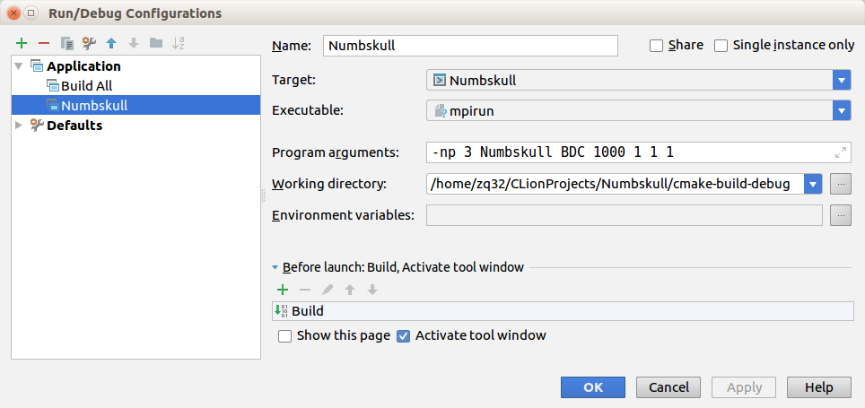

# Numbskull
A distributed Gibbs sampling framework

Still developing...

## Installation Dependency
### Ubuntu 16.04
```bash
sudo apt update
sudo apt upgrade
sudo apt install libboost-all-dev cmake build-essential git
```
These commands will install boost 1.58.0, openmpi 1.10.2 and cmake 3.5.1

### Ubuntu 18.04
```bash
sudo apt update
sudo apt upgrade
sudo apt install libboost-all-dev cmake build-essential git
```
These commands will install boost 1.65.1, openmip 2.2.1 and cmake 3.10.2

Build the project and run test case
```bash
cd ~
git clone https://github.com/qzshadow/Numbskull.git
cd Numbskull
mkdir cmake-build-debug && cd cmake-build-debug
cmake -DCMAKE_C_COMPILER=mpicc -DCMAKE_CXX_COMPILER=mpic++ ..
make
cd ../test
chmod a+x ./test.sh && sh ./test.sh
```
Script `test.sh` will test your deployment. 
it will run four simple graphs partitioned by `BDC` type,
see source code of `test.sh` for detailed configuration. 
The reasonable output should looks like this:
 
 (due to randomness,
the exact count will be slightly different from this, 
however, the ratio for one variable take 0 or 1 will be similar)
```text
machine#1 var: 1 value: 0 count: 320
machine#1 var: 1 value: 1 count: 680
machine#2 var: 1 value: 0 count: 311
machine#2 var: 1 value: 1 count: 689
machine#0 var: 0 value: 0 count: 215
machine#0 var: 0 value: 1 count: 785

machine#0 var: 0 value: 0 count: 67
machine#0 var: 0 value: 1 count: 933
machine#1 var: 2 value: 0 count: 284
machine#1 var: 2 value: 1 count: 716
machine#1 var: 1 value: 0 count: 296
machine#1 var: 1 value: 1 count: 704
machine#2 var: 2 value: 0 count: 283
machine#2 var: 2 value: 1 count: 717
machine#2 var: 1 value: 0 count: 282
machine#2 var: 1 value: 1 count: 718

machine#0 var: 0 value: 0 count: 336
machine#0 var: 0 value: 1 count: 664
machine#1 var: 2 value: 0 count: 373
machine#1 var: 2 value: 1 count: 627
machine#1 var: 1 value: 0 count: 380
machine#1 var: 1 value: 1 count: 620
machine#2 var: 2 value: 0 count: 408
machine#2 var: 2 value: 1 count: 592
machine#2 var: 1 value: 0 count: 417
machine#2 var: 1 value: 1 count: 583

machine#0 var: 1 value: 0 count: 285
machine#0 var: 1 value: 1 count: 715
machine#0 var: 0 value: 0 count: 301
machine#0 var: 0 value: 1 count: 699
machine#1 var: 2 value: 0 count: 355
machine#1 var: 2 value: 1 count: 645
machine#2 var: 2 value: 0 count: 348
machine#2 var: 2 value: 1 count: 652
```

## Import the project to Clion
1. Download Clion 2018.1 at https://www.jetbrains.com/clion/ and install it

2. In the "welcome to Clion" screen, choose "Check out from Version Control"
Use the correct URL and login info to check the project to local machine

3. After checking out, you will open the project in the Clion editor

4. Choose "File->Settings", search for "Toolchains", in the right panel, change C Compiler to "/usr/bin/mpicc", change C++ Compiler to "/usr/bin/mpic++", you do not need to change CMake and Debugger, using the Bundled is fine.

5. Choose "Run->Edit Configurations", add a Application called Numbskull and configure is in the following ways:
**The working directory should correspond to the the ClionProjects folder on your machine.**


6. Syntax for *Program arguments* is
```
-np total_machine  Numbskull graph_type num_samples num_var_on_master num_fac_per_worker num_var_per_fac
```
so the configuration in above figure means "create a 1 master,
2 worker cluster, 1 variable on master, 1 factor per worker,
1 variable per factor on worker, using `BDC` partition,
sample every variable for 1000 times."

7. Then hit the green triangle button (run) in the up right corner of CLion,
 the output should be like this:
 ```text
/usr/bin/mpirun -np 3 Numbskull BDC 1000 1 1 1
machine#0 var: 0 value: 0 count: 219
machine#0 var: 0 value: 1 count: 781
machine#1 var: 1 value: 0 count: 304
machine#1 var: 1 value: 1 count: 696
machine#2 var: 1 value: 0 count: 322
machine#2 var: 1 value: 1 count: 678

Process finished with exit code 0
```
Again, due to randomness, the count will not be exactly as above, however,
 the ratio should be similar.
## Debug
Debug using multiple GDB instance:

In a terminal, get into the folder contains runable "Numbskull", generally it will be located at "~/CLionProjects/Numbskull/cmake-build-debug", using the command
```
mpirun -np [NUM] xterm -e gdb Numbskull [PARAMETERS]
```

[NUM] should be replaced to the total machine number of master and workers,
[PARAMETERS] should be replaced by `graph_type num_samples num_var_on_master num_fac_per_worker num_var_per_fac`

## Other things helps you debug
if you are using CLion, every time see error like "invaild world rank"
check **Executable** in the run configuration (see the graph above), make sure it is **mpirun** rather than Numbskull.
